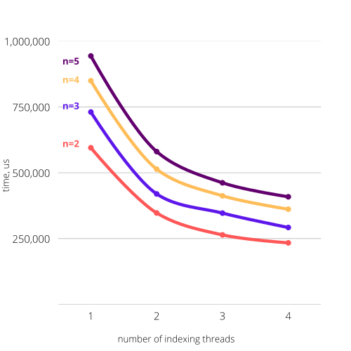

# N-gram Text Prediction

## About the project
<table>
 <tr>
    <td>The aim of the project is to develop an application
for extracting N-grams from the text, which can work with unlimited text size
and quickly and efficiently use available resources.
</td>
    <td><pre><code>
            /\-/\           
        /) = ^I^ =
       ((_ /'-^-'\ _ 
        `\`\ \ / /`/           
          (_\_|_/_)
           """ """</code></pre></td>
 </tr>
</table>

## About the project
The aim of the project is to develop an application
for extracting N-grams from the text, which can work with unlimited text size
and quickly and efficiently use available resources.

The application works in two modes: **training** and **prediction**.
The user sets the set of texts for learning, and also selects certain settings
of the analysis (1-gram, 2-gram, 3-gram, parallelization settings). After the training is completed,
user can enter the prediction mode and test it.

## Description of the algorithm
The foundation of the algorithm is a language model,
which computes the probability of a sentence or sequence of words.

For example, the phrase “The cat is sleeping” is more likely to appear than “The cat is dancing” in some writing.
The probability of these sentences can be shown as:
```
P("The cat is sleeping") > P("The cat is dancing")
```
where the probability, P, of the sentence “The cat is sleeping” is greater than the sentence “The cat is dancing”
based on our general knowledge.

The prediction of the next words using n-gram technique, say for `n=3`, approximates
the probability of `P("The cat is sleeping")` to `P("cat is sleeping"`), which can be
calculated as `P("sleeping"|"cat is")` (— what is the probability of the phrase "cat is" followed by a word "sleeping"?).

The calculation of this probability in our program is done by the following formula:
```
P("sleeping"|"cat is") = C("cat is sleeping")/C("cat is")
```
where the count, C, denotes the number of such phrases in text.

Thus, the main task of our project is to effectively remove n-grams from the text, calculate the probability and
offer some of the most likely words to the user.

### Training mode
The main steps of the training are as follows:
1. reading files — parallel;
2. indexing — parallel;
3. merging maps — parallel;
4. calculating probability;
5. writing results to the output files.

### Prediction mode
The main steps of the prediction are as follows:
1. transforming files to the maps — parallel;
2. user input processing;
3. finding the most probable following words.

## Usage

### Prerequisites
- `CMake`
- `boost`
- `tbb`

### `.cfg` file settings
```
indir = "../data"                       # source directory for files

ngram_par = 3                           # parameter n > 1
option = 0                              # 0 for counting and 1 for word prediction
word_num = 3                            # number of words to predict > 0

out_prob = "../results/out_prob.txt"    # file to save result probabilities
out_ngram = "../results/out_words.txt"  # file to save result n-gram and following words

index_threads = 2                       # threads used for indexing >= 1
merge_threads = 2                       # threads used for merging >= 1
prediction_threads = 4                  # threads for prediction >= 1

files_queue_s = 1000000                 # amount of max file paths in files_queue
strings_queue_s = 1000000000            # max size of queue of strings in bytes
merge_queue_s = 10000                   # max amount of elements in merging queue

allowed_ext = .txt .zip                 # extensions to index (supported only .zip and .txt)
```

### Testing
1. Clone the repository.
2. Set the desired attributes in `.cfg` file.
3. Train the model:
    - compile the program with `./compile.sh -O`
    - go to the `bin` directory
    - run `./N-Grams ../index.cfg`

   where the argument is the path to `.cfg` file.
4. Test model in the prediction mode.
   - change the `option` to 1 in the `.cfg` file
   - run `./N-Grams ../index.cfg`
     - after the preprocessing for prediction is done, the input from user will be requested

### Example


## Results
Comparing plots of different settings for **indexing**.



## Roadmap
- [x] Implement sequential training algorithm
- [x] Implement sequential prediction algorithm
- [x] Implement parallel training
- [x] Implement parallel processing for prediction
- [x] Add processing of unknown words
- [ ] Build comparing plots for different settings

# Contributors:
- [Alina Muliak](https://github.com/alinamuliak)
- [Anastasiia Tkachyshyn](https://github.com/tkachyshyn)
- [Oleksandra Stasiuk](https://github.com/oleksadobush)
